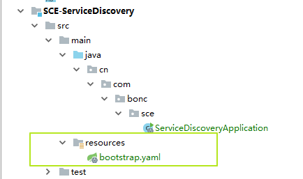

[TOC]

# 统一配置服务 SCE-ConfigServer

本项目用于存储和提供福建星云项目各组件配置文件，所有子自减的配置文件均需要被放置到此项目的 `resources\config` 文件夹中。

项目的所有子组件均需配置 Spring-Cloud-Config ，在启动时从此项目的实例中拉取服务的详细配置，而子组件本身只保有最基本的配置项，并置于该组件 `classpath:bootstrap.yaml` 配置文件内。

**存放在 Spring-Cloud-Config 中的配置文件的名称，必须与组件初始化配置文件中 `spring.application.name` 中相同，但可设置多个 profiles 来切换不同的配置组。**

以服务发现组件为例：



组件内只保存最基本的启动初始化配置文件，其内容可查看 <a href="#target0">子项目基本配置文件示例</a>

而其余配置则需放到本项目 `resources/config` 目录下：


**文件名则需要和项目初始化配置文件 `bootstrap.yaml` 中的 `spring.application.name` 配置项同步**：

```yaml
spring:
  application:
    name: sce-discovery-service
```

## 子项目基本配置文件示例

<a name="target0"></a>

在项目的 bootstrap.yaml 初始化配置文件当中，仅保留以下配置项：

- profiles 设置
    - active profile 设置
- logger 配置
- 服务名称配置
- 统一配置服务相关配置

以服务发现组件为例:


```yaml
spring.profiles.active: dev

---
spring.profiles: dev
spring:
  application:
    name: sce-discovery-service
  cloud:
    config:
      uri: http://localhost:10099
logging:
  file: ./logs/dev_app.log
  pattern:
    console: "%d %-5level %logger : %msg%n"
    file: "%d %-5level [%thread] %logger : %msg%n"
  level:
    org.springframework: INFO
    guru.springframework.controllers: INFO
    org.hibernate: INFO
```

**可以通过设置不同的 profiles 来存储多组配置，并通过 `spring.profiles.active` 来指定具体使用的配置组**